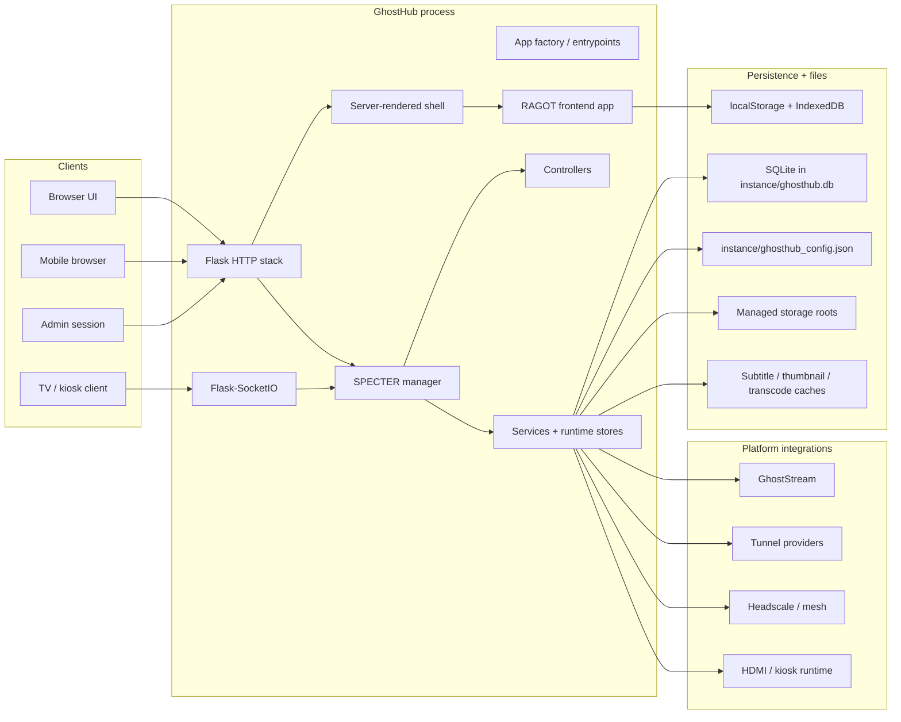
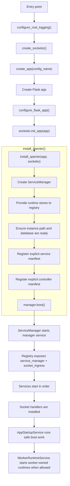
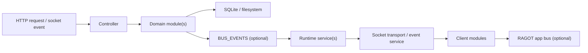
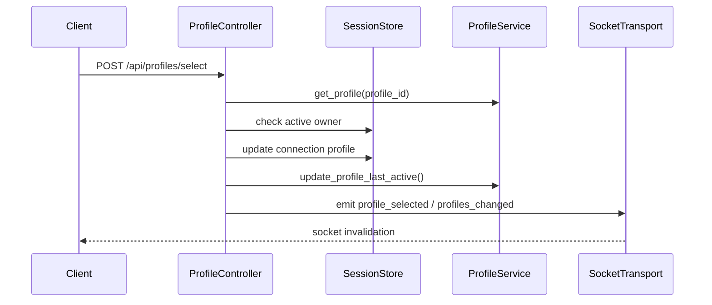
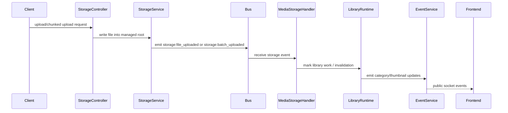
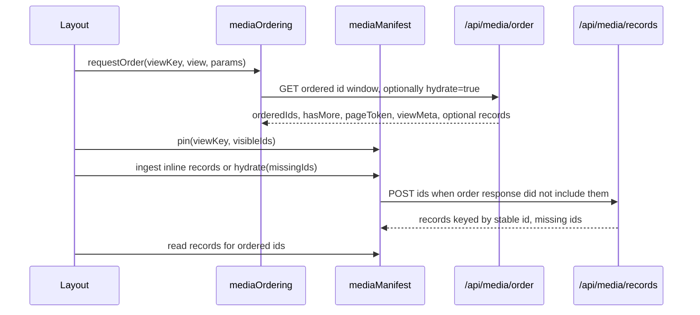

# GhostHub Architecture

GhostHub is a monolithic, lifecycle-driven media platform optimized for Raspberry Pi-class hardware. It is a single product surface composed from:

- a Flask app factory and HTTP ingress layer
- SPECTER-managed backend services, controllers, handlers, and runtime stores
- a server-rendered HTML shell
- a RAGOT-managed frontend application with explicit module/component ownership
- SQLite, managed storage roots, and browser-local fallback state
- optional platform integrations such as GhostStream, tunnels, mesh networking, HDMI, and kiosk flows

This document is intentionally code-truth-first. It describes how GhostHub is wired today, where ownership lives, and where new code should go.

Related references:
- [Design Language](./DESIGN_LANGUAGE.md)
- [How To Use GhostHub](./HOW_TO_USE_GHOSTHUB.md)
- `specter-runtime` package docs/source
- RAGOT frontend runtime: `static/js/libs/ragot.esm.min.js`
- [Controller Notes](../app/controllers/README.md)
- [Layout Guide](../static/js/modules/layouts/README.md)

---

## 1. Why The Architecture Looks Like This

GhostHub has crossed the size threshold where "just put it where it works" stops scaling.
At roughly 90k LOC, the architecture needs to optimize for:

- deterministic startup and teardown
- explicit ownership of long-lived side effects
- easy inspection of boot order and manifests
- clear separation between public APIs, internal events, and local state
- hardware-aware behavior on 2 GB devices
- maintainability in a codebase that spans media, storage, sync, chat, TV casting, tunnels, and device management

The core architectural stance is:

1. One deployable app, not multiple mini-apps.
2. Explicit composition beats dynamic discovery.
3. Lifecycles own side effects.
4. Product state is layered, not global.
5. Pi reliability wins over cleverness.

---

## 2. System Topology



### 2.1 Product shape

GhostHub is one application shell with multiple capability areas:

- local media browsing and playback
- two first-class layouts: `streaming` and `gallery`
- profile-aware and guest-tolerant preferences
- real-time sync and chat
- admin-only system, visibility, and storage controls
- TV cast, HDMI, and kiosk support
- optional GhostStream transcoding
- optional remote access and mesh tooling

The layout changes browsing behavior. It does not create a separate app.

---

## 3. Architectural Principles

### 3.1 Lifecycle-first ownership

GhostHub uses the same ownership rule on both sides of the stack:

- backend side effects belong to SPECTER `Service` / `Controller` / handler lifecycles
- frontend side effects belong to RAGOT `Module` / `Component` lifecycles

Long-lived listeners, timers, sockets, cleanup loops, and registry entries should have an explicit owner.

### 3.2 Explicit manifests over runtime discovery

GhostHub does not auto-scan services or controllers:

- backend services are composed in [`app/app_bootstrap.py`](../app/app_bootstrap.py)
- backend controllers are composed in [`app/controllers/__init__.py`](../app/controllers/__init__.py)
- frontend shared modules are registered in [`static/js/main.js`](../static/js/main.js)

This keeps startup deterministic and reviewable.

### 3.3 One shell, multiple modes

GhostHub runs one server-rendered shell from [`templates/index.html`](../templates/index.html) and one client composition root from [`static/js/main.js`](../static/js/main.js).

Shared capabilities such as search, viewer, settings, admin, sync, chat, profiles, notifications, GhostStream, and TV cast live above the active layout.

### 3.4 Layered identity, not a single "user" abstraction

GhostHub distinguishes:

- browser/session identity
- admin role ownership
- active profile identity
- guest mode

These affect persistence, socket fanout, permissions, and preference resolution differently.

### 3.5 Pi-first hardware posture

GhostHub treats low-memory hardware as a first-class deployment target, not an edge case.

Operational defaults assume:

- LITE: 2 GB RAM
- STANDARD: 4 GB RAM
- PRO: 8 GB+

Anything that allocates aggressively, blocks boot, or scales poorly with large libraries has to justify itself.

---

## 4. Runtime Composition And Boot

### 4.1 Entry points

| File | Role |
|---|---|
| `ghosthub.py` | Main script entrypoint for local/device runs. |
| `wsgi.py` | WSGI/Gunicorn entrypoint. |
| [`app/__init__.py`](../app/__init__.py) | Flask app factory. |
| [`app/app_bootstrap.py`](../app/app_bootstrap.py) | Composition root for logging, Flask config, Socket.IO, SPECTER services, controllers, and runtime stores. |

### 4.2 Boot sequence



### 4.3 Important boot invariants

The composition layer in [`app/app_bootstrap.py`](../app/app_bootstrap.py) guarantees:

- root logging is configured once per process
- Socket.IO is created with GhostHub defaults
- Flask config is normalized before SPECTER boot
- runtime stores are provided to the registry before services need them
- SQLite schema is made ready before services start
- services are sorted by `(priority, name)` before registration
- controllers are registered from a deterministic class manifest

### 4.4 Flask and Socket.IO defaults

Current defaults from [`app/app_bootstrap.py`](../app/app_bootstrap.py):

- `async_mode='gevent'`
- `ping_timeout=120`
- `ping_interval=10`
- `cors_allowed_origins='*'`
- `max_http_buffer_size=50 MB`
- `MAX_CONTENT_LENGTH=16 GB`
- permanent session lifetime derived from `SESSION_EXPIRY`

### 4.5 What SPECTER actually does here

The SPECTER `ServiceManager` in `specter.core.manager` is the runtime orchestrator.
It:

- starts itself first so it can own registry entries
- publishes `service_manager` and `socket_ingress`
- starts all registered services in order
- installs controller handlers after services are live
- tears handlers down before services during shutdown

This is one of the most important design choices in the backend: startup and teardown are ordered and explicit.

---

## 5. Backend Architecture

### 5.1 Backend layers

| Layer | Primary responsibility |
|---|---|
| Flask app factory | process boot, config, extension initialization |
| SPECTER manager | service lifecycle and handler orchestration |
| Controllers | public HTTP routes and public socket ingress |
| Services | long-lived runtime ownership and backend event fanout |
| Plain domain modules | CRUD, indexing, filesystem, query, and transformation logic |
| Runtime stores | mutable process-owned state that should not live in `current_app` globals |

### 5.2 Controller model

Controllers are SPECTER controllers, not raw Flask blueprints plus ad hoc socket callbacks.

Each controller can own:

- HTTP route registration through `build_routes(...)`
- socket handler registration through `build_events(...)`
- validation schemas and error shaping

Current controller composition is declared in [`app/controllers/__init__.py`](../app/controllers/__init__.py).

Controller families:

| Domain | Controllers |
|---|---|
| `core` | `MainController`, `ConnectionController`, `ProfileController` |
| `media` | `CategoryController`, `MediaController`, `MediaOrderingController`, `MediaRecordsController`, `MediaDeliveryController`, `MediaDiscoveryController`, `ProgressController`, `SubtitleController` |
| `storage` | `StorageManagementController`, `StorageFileController`, `StorageUploadController` |
| `streaming` | `ChatController`, `SyncController` |
| `system` | `ConfigController`, `SystemTransferController`, `SystemTunnelController`, `SystemUtilityController`, `TVController` |
| `ghoststream` | `GhostStreamController` |
| `admin` | `AdminController`, `AdminMaintenanceController`, `AdminSystemController`, `AdminVisibilityController` |

### 5.3 Service model

Services are where long-lived backend behavior belongs.

Current service composition is declared in [`app/app_bootstrap.py`](../app/app_bootstrap.py).
The active manifest includes service families across:

| Domain | Examples |
|---|---|
| `core` | `AppStartupService`, `AppRequestLifecycleService`, `RuntimeConfigService`, `SocketTransportService`, `WorkerRuntimeService` |
| `media` | `LibraryRuntimeService`, `IndexingRuntimeService`, `ThumbnailRuntimeService`, `MediaStorageEventHandlerService`, `MediaOrderingService`, `MediaRecordsService`, `ProgressEventService` |
| `storage` | `StorageDriveRuntimeService`, `StorageEventService`, `UploadSessionRuntimeService`, `StorageWorkerBootService` |
| `streaming` | `ChatEventService`, `SyncEventService` |
| `ghoststream` | `GhostStreamRuntimeService`, `GhostStreamEventService`, `TranscodeCacheRuntimeService`, `GhostStreamWorkerBootService` |
| `system` | `HdmiRuntimeService`, `TVCastService`, `TVEventService`, `HeadscaleRuntimeService`, `MeshWatchdogService`, `TunnelUrlCaptureService`, `FactoryResetService`, `SystemWorkerBootService` |

Important nuance:

- not every "service" in `app/services/**` is a SPECTER `Service`
- many files under `app/services/**` are plain domain/service modules
- SPECTER services own lifecycle, fanout, and runtime loops
- plain modules usually own synchronous business logic, queries, and filesystem/database operations

### 5.4 Runtime stores

GhostHub deliberately moved mutable process state out of Flask globals and into stores.

Examples:

- [`app/services/core/session_store.py`](../app/services/core/session_store.py)
- [`app/services/storage/upload_session_store.py`](../app/services/storage/upload_session_store.py)
- [`app/services/system/display/hdmi_runtime_store.py`](../app/services/system/display/hdmi_runtime_store.py)
- [`app/services/media/category_runtime_store.py`](../app/services/media/category_runtime_store.py)
- [`app/services/media/sort_runtime_store.py`](../app/services/media/sort_runtime_store.py)
- [`app/services/ghoststream/transcode_cache_runtime_store.py`](../app/services/ghoststream/transcode_cache_runtime_store.py)

This matters because GhostHub is gevent-based. Shared mutable state needs an explicit owner and concurrency discipline.

### 5.5 Domain boundaries

#### Core domain

Core code owns application-level plumbing:

- request/session lifecycle
- runtime config access
- profile CRUD and preference normalization
- SQLite bootstrap and schema versioning
- admin lock coordination
- startup sequencing

Key files:

- [`app/services/core/runtime_config_service.py`](../app/services/core/runtime_config_service.py)
- [`app/services/core/profile_service.py`](../app/services/core/profile_service.py)
- [`app/services/core/session_store.py`](../app/services/core/session_store.py)
- [`app/services/core/database_bootstrap_service.py`](../app/services/core/database_bootstrap_service.py)
- [`app/services/core/database_schema_service.py`](../app/services/core/database_schema_service.py)

#### Media domain

Media code owns library semantics:

- category discovery and hierarchy
- category persistence and caching
- media indexing and query surfaces
- media ordering windows and record hydration
- hidden-content enforcement
- subtitle handling
- progress persistence
- library/background scan behavior

Representative modules:

- [`app/services/media/category_service.py`](../app/services/media/category_service.py)
- [`app/services/media/media_index_service.py`](../app/services/media/media_index_service.py)
- [`app/services/media/media_ordering_service.py`](../app/services/media/media_ordering_service.py)
- [`app/services/media/media_records_service.py`](../app/services/media/media_records_service.py)
- [`app/services/media/video_progress_service.py`](../app/services/media/video_progress_service.py)
- [`app/services/media/subtitle_service.py`](../app/services/media/subtitle_service.py)
- [`app/services/media/library_runtime_service.py`](../app/services/media/library_runtime_service.py)

#### Media data fetch contract

Media browsing is split into two explicit channels:

| Channel | Endpoint | Owner | Payload role |
|---|---|---|---|
| ordering | `GET /api/media/order` | `MediaOrderingController` and `MediaOrderingService` | returns ordered stable ids, pagination state, and view metadata; can inline-hydrate the returned window when `hydrate=true` |
| hydration | `POST /api/media/records` | `MediaRecordsController` and `MediaRecordsService` | returns canonical media records keyed by id |

The server owns query semantics and ordering. It does not send full record lists for every browsing view. View-shaped requests such as streaming rows, subfolder grids, gallery timeline pages, gallery months, and search first ask for ordered ids. The client then hydrates only the missing ids through the records endpoint or uses `hydrate=true` to hydrate the returned sliding window in the same response.

Stable media ids use:

```text
<category_id>::<rel_path>
```

That id is the canonical join key between ordering windows, hydrated records, invalidation events, viewer navigation, and search results.

Large-library behavior depends on this split. A 10k+ item library should not become a 10k-record response just because a layout opens. Each mounted view pins only the ids in its visible or near-visible window, requests hydration for records missing from the shared manifest, and lets unpinned records age out through client-side LRU eviction.

#### Storage domain

Storage code owns filesystem mutation inside managed roots:

- drive discovery and mount state
- folder creation/deletion
- upload sessions and chunk assembly
- rename/delete operations
- archive packaging and download surfaces

Representative modules:

- [`app/services/storage/storage_drive_service.py`](../app/services/storage/storage_drive_service.py)
- [`app/services/storage/standard_upload_service.py`](../app/services/storage/standard_upload_service.py)
- [`app/services/storage/upload_session_runtime_service.py`](../app/services/storage/upload_session_runtime_service.py)
- [`app/services/storage/storage_media_file_service.py`](../app/services/storage/storage_media_file_service.py)
- [`app/services/storage/storage_archive_service.py`](../app/services/storage/storage_archive_service.py)

#### Streaming domain

Streaming code owns collaborative real-time behavior:

- chat rooms and messages
- sync room lifecycle
- playback state fanout
- guest/host restrictions

Representative modules:

- [`app/controllers/streaming/chat_controller.py`](../app/controllers/streaming/chat_controller.py)
- [`app/controllers/streaming/sync_controller.py`](../app/controllers/streaming/sync_controller.py)
- [`app/services/streaming/chat_event_service.py`](../app/services/streaming/chat_event_service.py)
- [`app/services/streaming/sync_event_service.py`](../app/services/streaming/sync_event_service.py)

#### System domain

System code owns platform and device responsibilities:

- hardware stats and hardware tiering
- rate limiting
- WiFi AP config sync
- HDMI and kiosk runtime
- TV cast support
- tunnel and mesh coordination
- factory reset signaling

Representative modules:

- [`app/services/system/system_stats_service.py`](../app/services/system/system_stats_service.py)
- [`app/services/system/rate_limit_service.py`](../app/services/system/rate_limit_service.py)
- [`app/services/system/display/hdmi_runtime_service.py`](../app/services/system/display/hdmi_runtime_service.py)
- [`app/services/system/display/tv_cast_service.py`](../app/services/system/display/tv_cast_service.py)
- [`app/services/system/tunnel/service.py`](../app/services/system/tunnel/service.py)
- [`app/services/system/headscale/runtime_service.py`](../app/services/system/headscale/runtime_service.py)

#### GhostStream domain

GhostStream code is the optional transcoding and capability subsystem:

- runtime discovery and health
- capability reporting
- transcode job lifecycle
- cached stream asset serving
- frontend capability integration

Representative modules:

- [`app/controllers/ghoststream/ghoststream_controller.py`](../app/controllers/ghoststream/ghoststream_controller.py)
- [`app/services/ghoststream/ghoststream_runtime_service.py`](../app/services/ghoststream/ghoststream_runtime_service.py)
- [`app/services/ghoststream/ghoststream_service.py`](../app/services/ghoststream/ghoststream_service.py)
- [`app/services/ghoststream/transcode_cache_service.py`](../app/services/ghoststream/transcode_cache_service.py)

---

## 6. Worker Runtime And Background Work

Not every process should start every background loop.

GhostHub centralizes post-boot background runtime policy in [`app/services/core/worker_runtime_service.py`](../app/services/core/worker_runtime_service.py).

### 6.1 Worker boot policy

`WorkerRuntimeService` decides whether to initialize worker-owned runtimes based on environment and process mode.
When initialization is allowed, it delegates to domain-specific boot owners:

- [`app/services/media/worker_boot_service.py`](../app/services/media/worker_boot_service.py)
- [`app/services/storage/worker_boot_service.py`](../app/services/storage/worker_boot_service.py)
- [`app/services/system/worker_boot_service.py`](../app/services/system/worker_boot_service.py)
- [`app/services/ghoststream/worker_boot_service.py`](../app/services/ghoststream/worker_boot_service.py)

### 6.2 Background work currently started this way

Examples include:

- library scan scheduling
- stale media cleanup
- subtitle cache cleanup
- upload session cleanup
- HDMI runtime initialization
- rate limiter initialization
- optional tunnel auto-start
- GhostStream runtime initialization

### 6.3 Why this split exists

This avoids:

- duplicate background loops across master and worker processes
- incorrect startup behavior in hosted deployments
- hidden runtime side effects triggered by module import order

If code needs to "run in the background", it belongs under an explicit runtime owner, not a random import side effect.

---

## 7. Persistence And Data Ownership

### 7.1 SQLite as the primary relational store

SQLite lives at `instance/ghosthub.db` and is accessed through [`app/services/core/sqlite_runtime_service.py`](../app/services/core/sqlite_runtime_service.py).

Important runtime choices:

- greenlet-local connections
- `WAL` mode
- `foreign_keys=ON`
- `temp_store=MEMORY`
- tier-aware cache and `mmap_size` tuning
- use of `/tmp/ghosthub_sqlite` when present for SQLite temp files

### 7.2 Schema ownership

Schema creation and compatibility are owned by:

- [`app/services/core/database_schema_service.py`](../app/services/core/database_schema_service.py)
- [`app/services/core/database_bootstrap_service.py`](../app/services/core/database_bootstrap_service.py)

Current schema version: `15`

GhostHub does not use a general-purpose migration framework. Instead, the bootstrap layer:

- creates canonical tables and indexes
- upgrades a known small set of legacy versions
- rejects unsupported schema versions

### 7.3 Main persistent tables

| Table | Responsibility |
|---|---|
| `schema_info` | schema metadata |
| `categories` | category roots and metadata |
| `profiles` | profile identities and preferences |
| `video_progress` | server-side continue-watching by `profile_id` |
| `hidden_categories` | hidden category state |
| `hidden_files` | hidden file state |
| `file_path_aliases` | rename continuity for progress lookups |
| `media_index` | indexed media rows for query and browsing |
| `drive_labels` | persisted drive labels |

### 7.4 Filesystem and cache ownership

Not all persistence is relational.

| Concern | Source of truth |
|---|---|
| application config | `instance/ghosthub_config.json` |
| media library | managed storage roots |
| thumbnails / subtitle caches / transcode artifacts | GhostHub-managed cache locations |
| guest UI preferences | browser `localStorage` |
| guest progress fallback | browser IndexedDB |

### 7.5 Config layering

Configuration resolves through multiple layers:

1. hardcoded defaults in [`app/config.py`](../app/config.py)
2. persisted JSON config in [`app/services/core/config_service.py`](../app/services/core/config_service.py)
3. environment overrides for supported keys
4. runtime reads and writes through [`app/services/core/runtime_config_service.py`](../app/services/core/runtime_config_service.py)

This means "config" is not a single file read once at import time. It is a layered runtime contract.

---

## 8. Identity, Sessions, Profiles, And Guest Mode

### 8.1 Four distinct identity scopes

GhostHub intentionally separates:

| Scope | Stored in | Why it exists |
|---|---|
| browser session | Flask session cookie | request/session continuity |
| live socket/session mapping | `session_store` | connection-aware fanout and presence |
| admin lock owner | `session_store` + persisted `admin_lock.json` | single active admin ownership across workers |
| active profile | Flask session plus connection annotations | profile-scoped preferences and progress |

### 8.2 Profile model

Profiles are owned by:

- [`app/controllers/core/profile_controller.py`](../app/controllers/core/profile_controller.py)
- [`app/services/core/profile_service.py`](../app/services/core/profile_service.py)

Current profile data includes:

- stable UUID
- display name
- avatar color
- avatar icon
- merged preference payload
- `created_at`
- `last_active_at`

Profiles are constrained intentionally:

- max 20 profiles
- normalized names
- validated avatar metadata
- preference schema for `theme`, `layout`, `motion`, and feature toggles

### 8.3 Active profile ownership and exclusivity

The active profile is session-scoped, not globally user-scoped.

Important rules enforced today:

- the active profile is stored in the Flask session as `active_profile_id`
- socket/session state mirrors the active profile for live presence
- a profile cannot be active in multiple sessions at once
- profile changes fan out via socket signals so clients refresh

Public socket events:

- `profile_selected`
- `profiles_changed`

### 8.4 Guest mode is not a second-class fallback

GhostHub supports two persistence modes:

- active profile mode
  - preferences live in SQLite profile state
  - progress lives in `video_progress`
- guest mode
  - preferences live in browser `localStorage`
  - progress lives in browser IndexedDB

This dual-mode behavior is part of the product architecture, not a temporary compatibility hack.

---

## 9. Public API Surface, Socket Surface, And Internal Events

### 9.1 HTTP route families

The HTTP API is organized by capability:

| Family | Prefix | Responsibility |
|---|---|---|
| main shell | `/` | shell render and RAGOT lab ingress |
| profiles | `/api/profiles` and `/api/profiles/...` | profile CRUD and active-profile selection |
| config | `/api/config` | merged runtime config fetch/save |
| media and categories | `/api/categories`, `/api/search`, `/api/media/order`, `/api/media/records`, media-specific endpoints | categories, ordering windows, record hydration, discovery metadata |
| media delivery | `/media/...`, `/thumbnails/...` | content and artifact serving |
| progress | `/api/progress/...` | continue-watching operations |
| subtitles | `/api/subtitles/...` | subtitle discovery, extraction, and delivery |
| storage | `/api/storage/...` | drives, uploads, rename/delete, packaging |
| sync | `/api/sync/...` | sync status and control |
| admin | `/api/admin/...` | admin status, maintenance, visibility, system actions |
| system | `/api/system/...`, `/api/tunnel/...`, `/api/hdmi/...` | version, utilities, tunnel, HDMI, health |
| ghoststream | `/api/ghoststream/...` | capabilities, jobs, cache, stream support |

### 9.2 Public socket events

Public socket constants live in:

- [`app/constants.py`](../app/constants.py)
- [`static/js/core/socketEvents.js`](../static/js/core/socketEvents.js)

There are two public event families:

- `SOCKET_EVENTS` for browser/client collaboration
- `TV_EVENTS` for TV display and kiosk flows

Representative `SOCKET_EVENTS` groups:

- connection and heartbeat
- sync room lifecycle
- playback sync
- chat and slash commands
- admin kick and admin status
- profile selection and invalidation
- content visibility and file rename propagation
- thumbnail and progress updates
- GhostStream progress/status
- factory reset

Representative `TV_EVENTS` groups:

- TV connection and status
- cast requests and playback control
- subtitle handoff
- HDMI status
- kiosk boot lifecycle

### 9.3 Internal backend bus

Backend-only fanout uses `BUS_EVENTS` from [`app/constants.py`](../app/constants.py).

This bus coordinates service-to-service behavior such as:

- storage file lifecycle
- mount changes
- media scan lifecycle
- category invalidation
- thumbnail lifecycle
- system lifecycle markers

Rule of thumb:

- socket events are the public protocol
- bus events are internal runtime fanout
- local function calls are still preferred when no broadcast semantics are needed

### 9.4 Media browsing API contract

The canonical browsing API is id-first. Three endpoints own everything:

| Endpoint | Method | Owner | Role |
|---|---|---|---|
| `/api/media/order` | GET | `MediaOrderingController` → `MediaOrderingService` | Single ordered id window. Returns `{ orderedIds, hasMore, pageToken, viewMeta }`. Optional `{ records, missing }` when `hydrate=true`. |
| `/api/media/orders` | POST | `MediaOrderingController` | Batched ordered id windows. Body: `{ requests: [<order params>...] }`, max 50. Each request is fetched in parallel via gevent and returned in the same order as input. Used by the streaming layout to populate every row's `orderedIds` in one round-trip. |
| `/api/media/records` | POST | `MediaRecordsController` → `MediaRecordsService` | Stable id hydration. Body: `{ ids: [...] }`, max 200. Returns `{ records, missing }`. |

Authoritative canonical view types (declared in `MediaOrderingController.CANON_VIEW_TYPES`):

- `streaming_row` — one streaming layout horizontal row, scoped to a category.
- `streaming_grid` — single-category grid in the streaming layout.
- `subfolder_grid` — drilled-into subfolder grid in the streaming layout.
- `gallery_timeline` — gallery date-grouped timeline (whole timeline or a single date page).
- `gallery_month` — gallery month overlay.
- `whats_new` — recent-media row.
- `search` — search result window. The id list comes from `/api/search` (which still owns category/folder/parent matching); files inside the search result are hydrated through `mediaManifest` the same way.
- `viewer_category` — backing view the active viewer pages through. The controller maps this to `streaming_grid`/`subfolder_grid` server-side.
- `viewer_local` — client-only synthetic view for share-link / single-record viewers. Never sent to the server.

Surrounding endpoints:

- `/api/search` returns the same `viewKey` / `orderedIds` / `records` / `viewMeta` shape so the client can ingest it through `hydrateSearchResults` (`static/js/modules/media/searchDataSource.js`) without a separate code path.
- `/api/media/timeline/years` is metadata-only for timeline navigation.

Stable media id format: `<category_id>::<rel_path>`. This is the join key between ordering, records, invalidation payloads, viewer navigation, and card click identity (`card.dataset.recordId`).

Do not add new view-specific endpoints that return full media records for an entire category, month, row, or search page. New browsing surfaces should add a `view` shape to `MediaOrderingService` (and the `CANON_VIEW_TYPES` set), then hydrate records through `MediaRecordsService` — either by calling `/api/media/records` or by passing `hydrate=true` on the order request for the current window.

### 9.5 Event flow model



The important split is that server-side bus events do not replace public socket events, and frontend app-bus events do not replace the shared socket protocol.

---

## 10. Frontend Architecture

### 10.1 Server-rendered shell plus client-owned runtime

The main page is rendered by [`app/controllers/core/main_controller.py`](../app/controllers/core/main_controller.py) using [`templates/index.html`](../templates/index.html).

The server injects initial UI state into `<html>` attributes:

- `data-theme`
- `data-layout`
- `data-feature-*`

That contract matters because it prevents layout/theme flash and gives the frontend enough state to adopt the shell instead of rebuilding the page from scratch.

### 10.2 Frontend composition root

[`static/js/main.js`](../static/js/main.js) is the client composition root.

It registers shared runtime modules into the RAGOT registry, including:

- app state and store
- app DOM references
- media loading and navigation services
- media manifest, ordering, and invalidation modules
- UI controller
- sync and chat managers
- admin controls
- TV cast manager
- active layouts
- GhostStream manager
- shared notification services

### 10.3 Frontend boot sequence

Current startup in [`static/js/main.js`](../static/js/main.js) is deliberately phased:

1. ensure browser session id
2. initialize notification and tooltip infrastructure
3. fetch merged runtime config
4. set admin state in the app store
5. initialize profile selector
6. ensure or choose active profile
7. sync hidden-content visibility from the server
8. apply effective user preferences
9. initialize logger and theme manager
10. initialize shared gestures
11. initialize GhostStream early
12. initialize shell-level modules
13. initialize admin controls and TV cast UI
14. initialize shared media manifest, ordering, and invalidation modules
15. initialize guest IndexedDB progress when no active profile exists
16. initialize the active layout
17. create and wire the shared Socket.IO client

This order is not incidental. Profiles and visibility state affect early rendering.

### 10.4 Frontend shared state

[`static/js/core/app.js`](../static/js/core/app.js) owns the canonical client store via RAGOT `createStateStore(...)`.

Examples of shared state:

- admin state
- merged runtime config
- shared socket instance
- active profile metadata
- current category/page/index
- active media viewer position
- sync-mode flags
- preload/fetch/cleanup state
- low-memory cleanup timers

State mutation is intended to flow through the store and registered actions, not ad hoc object mutation from arbitrary modules. Full media record arrays do not belong in the app store; the normalized media manifest owns hydrated records.

### 10.5 Media manifest, ordering, selectors, and invalidation

Media records have one client-side owner. The frontend split mirrors the backend split: ordering owns id windows, manifest owns records, selectors project them into views, invalidation bridges the socket layer.

| Module | Responsibility |
|---|---|
| [`static/js/modules/media/manifest.js`](../static/js/modules/media/manifest.js) | Hydrated record store keyed by stable id. Owns pinning, missing ids, failed-id retry with backoff, batched hydration via `POST /api/media/records`, LRU eviction, and a per-frame `dirtyIds` set used by `subscribeView` to detect record changes. |
| [`static/js/modules/media/ordering.js`](../static/js/modules/media/ordering.js) | Per-view ordered id windows. Owns request status (`idle` / `fetching` / `ready` / `stale` / `error`), pagination via `_mergeIds`, request cancellation (one `AbortController` per view), bounded LRU of view entries, and `dropIdsFromAllViews` for surgical id removal across every cached view. |
| [`static/js/modules/media/selectors.js`](../static/js/modules/media/selectors.js) | The only layer that projects ordered ids into hydrated records (`selectRecordsForView`, `selectChunkRecords`, `selectIdAt`, `selectIndexOf`, `selectUnhydratedIdsInWindow`). Also exposes `subscribeView(viewKey, callback)` — the canonical subscription path layouts use to react to ordering + manifest changes for a single view. |
| [`static/js/modules/media/invalidation.js`](../static/js/modules/media/invalidation.js) | Single bridge between `CATEGORY_UPDATED` / `USB_MOUNTS_CHANGED` socket payloads and manifest + ordering state. Handles `invalidatedIds` (surgical), `category_id` (per-category), and `invalidateAll`. Emits `APP_EVENTS.FILE_RENAMED_UPDATED` on the client bus for non-manifest consumers (progress DB, viewer URL state). |
| [`static/js/modules/media/viewerState.js`](../static/js/modules/media/viewerState.js) | Viewer session selectors (`getViewerSession`, `setViewerSession`, `getCurrentViewerRecord`). The viewer holds a `viewKey` + `activeIndex` only; the visible record is always projected from the manifest. |
| [`static/js/modules/media/searchDataSource.js`](../static/js/modules/media/searchDataSource.js) | Ingests `/api/search` payloads into ordering + manifest (`hydrateSearchResults`) and builds file-result groups from selector output. |
| Layout adapters | [`streaming/mediaDataSource.js`](../static/js/modules/layouts/streaming/mediaDataSource.js) and [`gallery/mediaDataSource.js`](../static/js/modules/layouts/gallery/mediaDataSource.js) translate layout intent into `ordering.requestOrder` calls and project the resulting view through selectors. Streaming uses the batched `/api/media/orders` endpoint to fan out one row request per category in a single round-trip. |

The manifest is not a compatibility cache for old endpoints. It is the canonical client record store. Layouts store ordered ids and derive loaded/error state from ordering status plus manifest hydration state. Layout-private full-record arrays are an anti-pattern.

Manifest memory is tiered for Raspberry Pi targets rather than sized to whole libraries: LITE devices keep roughly 500 hydrated records, STANDARD devices keep roughly 1,200, and PRO browsers keep roughly 2,500. `mediaOrdering` caps cached view entries (default 64) with LRU eviction; the manifest caps confirmed-missing ids (default 4,000). Large libraries are re-derived from stable `viewKey` / `viewType` / `viewParams` instead of retained as unbounded client arrays.

Hydration failure is transient unless the records endpoint explicitly reports an id as missing. Failed pinned ids retry with exponential backoff capped at 10 s, and unpinned failed ids are dropped on the next retry sweep. This prevents a temporary records fetch failure from permanently poisoning the client manifest.

`MediaInvalidationModule` is the only place that should touch manifest + ordering in response to a socket event. Layouts must subscribe via `subscribeView` and react to the resulting view shape — they must not re-issue manifest invalidation in their own socket handlers. Doubling up there is how in-flight refetch `AbortController`s get cancelled mid-flight and rows end up stuck on stale ids.

### 10.6 RAGOT ownership split

GhostHub's frontend architecture depends on using RAGOT correctly:

| Primitive | Ownership role |
|---|---|
| `Module` | orchestration, sockets, timers, listeners, non-visual lifecycles |
| `Component` | UI subtree ownership |
| `createStateStore` | cross-feature mutable state |
| `ragotRegistry` | boot-time service registration and late binding |
| `bus` | one-to-many client-side broadcast |

Primary references:

- `static/js/libs/ragot.esm.min.js`
- [`static/js/modules/layouts/README.md`](../static/js/modules/layouts/README.md)

### 10.7 Frontend module families

| Area | Examples |
|---|---|
| core | `static/js/core/app.js`, `static/js/core/socketEvents.js`, `static/js/core/appEvents.js` |
| profile | `static/js/modules/profile/selector.js`, `static/js/modules/profile/events.js` |
| media | `static/js/modules/media/*` |
| playback | `static/js/modules/playback/*` |
| chat | `static/js/modules/chat/*` |
| sync and cast | `static/js/modules/sync/*` |
| admin | `static/js/modules/admin/*` |
| config UI | `static/js/modules/config/*` |
| layouts | `static/js/modules/layouts/streaming/*`, `gallery/*`, `shared/*` |
| shell UI | `static/js/modules/ui/*` |
| GhostStream | `static/js/modules/ghoststream/manager.js` |

---

## 11. Layout System

GhostHub currently ships two first-class layouts:

- `streaming`
- `gallery`

Both run inside the same application shell.

### 11.1 Shared shell contract

Regardless of layout, GhostHub keeps:

- one header
- one search system
- one viewer
- one chat system
- one settings/admin surface
- one profile selection flow
- one socket session
- one app store

### 11.2 Streaming layout

The streaming layout in [`static/js/modules/layouts/streaming/index.js`](../static/js/modules/layouts/streaming/index.js) is decomposed into single-responsibility component modules. The coordinator owns lifecycle and routing between row mode and grid mode; every visible row is its own RAGOT Component that subscribes to its own `viewKey`.

| File | Responsibility |
|---|---|
| `index.js` | `StreamingLayoutModule` lifecycle, `loadAndRender`, mount/unmount of container, hero, filter bar, rows container, and grid. |
| `componentWiring.js` | Setup of hero, filter bar, layout-level event listeners, filter actions, error rendering. |
| `CategoryRowsContainer.js` | One per layout. Subscribes to `streamingState` and reconciles the desired row identity set against mounted `CategoryRowComponent` children — mounts/unmounts only on identity change, no per-row data patching. |
| `CategoryRowComponent.js` | One per category-subfolder pair. Subscribes via `subscribeView(viewKey)`. Distinguishes append-only pagination (`vs.reset()`) from genuine shape change (full VS rebuild). Holds its own VS instance, scroll buttons, and subfolder-card decoration. |
| `ContinueWatchingRowComponent.js` | Driven by `streamingState.continueWatchingData` (progress-derived, not an ordering view). Uses RAGOT `renderList` for in-place patching. |
| `WhatsNewRowComponent.js` | Driven by both `streamingState.whatsNewData` and the backing `whats_new` ordering view via `subscribeView` — manifest invalidations reconcile the row in place. |
| `grid.js` | `StreamingGridComponent` for single-category / subfolder grids. Owns chunked vertical VS with `chunkContainer` so sentinels stay outside the CSS grid; supports `rebind` for category switches without a full remount. |
| `mediaDataSource.js` | All ordering/manifest reads + writes for this layout. Owns the batched `/api/media/orders` call. |
| `state.js` | `StreamingStateModule` (filters, pagination, CW/WN snapshots, viewKey derivation per category). |
| `rowShell.js` | Pure DOM helpers shared across row Components: shell builder, loading card, header/breadcrumb meta, prime-window math, prefetch heuristic. |
| `lazyLoad.js` | Streaming-only thumbnail IntersectionObserver wrapper. Buffers `observeLazyImage` calls and observes on the next RAF; re-queues disconnected images so VS chunk mounts win the race. |
| `pagination.js`, `indexUpdates.js`, `progressBars.js`, `progressUpdates.js`, `subfolderInstantNavigation.js` | Single-purpose handlers wired in from `index.js`. |
| `cards.js`, `hero.js`, `renderer.js` | Card factories, hero Component, container/filter bar Components. |

Streaming does not fetch or store category-sized record arrays. The data adapter requests ordered id windows for rows and grids, pins the ids that are currently needed, hydrates missing records through the shared manifest, and renders records projected from that manifest. Every card carries `data-record-id` (the stable id) and `data-media-url`; viewer entry resolves by stable id first and falls back to URL only for share/deep-link callers.

### 11.3 Gallery layout

The gallery layout in [`static/js/modules/layouts/gallery/index.js`](../static/js/modules/layouts/gallery/index.js) owns the archive-oriented browsing model: denser exploration, timeline/date grouping, photo-first navigation, gallery-specific interactions.

Gallery follows the same contract. `mediaDataSource.js` calls `ordering.requestOrder` with `gallery_timeline` for the date-grouped timeline (paginated by `dates_page`) and `gallery_month` for the month overlay. Records hydrate through `mediaManifest` and are read via `selectRecordsForView`. Month overlays hold a `viewKey` + `mediaIds`, never independent media arrays.

`/api/media/timeline/years` remains a separate metadata endpoint for the sidebar/mobile timeline — it does not flow through `MediaOrderingService` because it returns no media ids, only year/month structure.

### 11.4 Shared layout infrastructure

Cross-layout orchestration belongs in shared helpers, not duplicated layout code:

- [`static/js/modules/layouts/shared/layoutLifecycle.js`](../static/js/modules/layouts/shared/layoutLifecycle.js)
- [`static/js/modules/layouts/shared/socketHandlers.js`](../static/js/modules/layouts/shared/socketHandlers.js)
- [`static/js/modules/layouts/shared/filterActions.js`](../static/js/modules/layouts/shared/filterActions.js)
- [`static/js/modules/layouts/shared/subfolderNavigation.js`](../static/js/modules/layouts/shared/subfolderNavigation.js)

### 11.5 Layout ownership rule

Layouts should control browsing experience, not redefine app-wide services.

If a feature is shared across layouts, it usually belongs:

- in shell-level modules
- in layout shared helpers
- in the media manifest or ordering modules
- in the app store
- or in backend APIs/events

not inside one layout's private implementation.

---

## 12. Key End-To-End Flows

### 12.1 Profile selection flow



Important property: active profile selection is session-scoped and exclusive.

### 12.2 Upload to media visibility flow



The key design choice is that storage mutation and media indexing are decoupled by explicit internal events.

### 12.3 Media browsing hydration flow



Important properties:

- ordering requests are cancellable and settle as `ready` or `error`
- loading is derived from ordering status plus manifest hydration state
- temporary hydration failures retry; explicit missing ids do not loop forever
- invalidation drops affected records and marks scoped ordering views stale

### 12.4 Progress persistence flow

When an active profile exists:

- the frontend sends progress updates
- the backend persists by `profile_id`
- progress fanout can update the active client view

When no active profile exists:

- the frontend stores progress in IndexedDB
- no server-side profile row is required

### 12.4 TV cast flow

TV cast is a cross-layer feature:

- frontend cast manager emits `TV_EVENTS`
- backend TV controller and TV event service coordinate state
- HDMI/kiosk services maintain device/runtime state
- subtitle and playback state can be forwarded to the TV client

This is one of the clearest examples of why GhostHub uses explicit event families and runtime owners.

---

## 13. Performance And Hardware Strategy

### 13.1 Hardware tiers

GhostHub recognizes:

- LITE: 2 GB
- STANDARD: 4 GB
- PRO: 8 GB+

Tier-aware behavior exists in runtime services and database tuning.

### 13.2 Backend posture

Backend performance patterns visible in the current codebase:

- gevent concurrency rather than thread-lock assumptions
- worker-owned background loops
- bounded upload chunk sizing
- WAL-backed SQLite with tier-aware pragmas
- background cleanup instead of blocking request paths
- event-driven invalidation instead of synchronous full rescans on every mutation

### 13.3 Frontend posture

Frontend performance patterns visible in the current codebase:

- server-injected first paint state
- phased initialization instead of one giant boot step
- low-memory device detection
- cache sizing based on client device capacity
- lazy-loading and virtual-scroll-friendly architecture
- module-owned cleanup for timers, listeners, and sockets

### 13.4 Performance rule of thumb

GhostHub should feel polished on strong hardware, but the architecture is judged by how safely it behaves on LITE-tier devices with large libraries and long uptime.

---

## 14. Security And Trust Boundaries

### 14.1 Admin ownership

GhostHub uses a single active admin lock model.

Admin ownership is coordinated through:

- Flask session identity
- `session_store`
- a persisted `admin_lock.json` in the instance path

This provides cross-worker visibility of the current admin owner.

### 14.2 Managed storage roots as a trust boundary

Filesystem mutation code should operate only within managed storage roots.
User-provided paths are untrusted and must be validated and normalized before use.

### 14.3 Hidden content is a cross-cutting concern

Hidden-content enforcement has to be respected across:

- category listing
- media discovery
- progress lookups
- subtitle access
- transfer flows
- admin visibility changes

This is not just a frontend visibility toggle.

### 14.4 Event naming discipline

Security and maintainability both benefit from not hardcoding event strings:

- backend public socket events belong in [`app/constants.py`](../app/constants.py)
- frontend public socket events belong in [`static/js/core/socketEvents.js`](../static/js/core/socketEvents.js)
- backend internal bus events belong in `BUS_EVENTS`

### 14.5 Framework discipline

GhostHub avoids:

- raw Flask route sprawl outside SPECTER composition
- raw `socketio.on(...)` feature growth outside controller ownership
- unmanaged frontend listeners/timers in feature files

This is partly style and partly safety.

---

## 15. Extensibility Playbook

This is the practical "where should new code go?" section.

### 15.1 Add a new HTTP feature when

Use a controller when you are adding:

- a public route
- a public socket event
- request validation
- response shaping and auth enforcement

Start in:

- [`app/controllers/__init__.py`](../app/controllers/__init__.py)
- the relevant domain controller file

### 15.2 Add a new SPECTER service when

Use a SPECTER `Service` when the code owns:

- long-lived listeners
- periodic work
- background runtime state
- backend fanout to sockets
- post-boot initialization

Register it from [`app/app_bootstrap.py`](../app/app_bootstrap.py).

### 15.3 Add a plain domain module when

Use a plain module under `app/services/<domain>/` when the code is mostly:

- CRUD
- data transformation
- filesystem operations
- queries
- validation
- synchronous business logic

Do not turn every helper into a lifecycle service.

### 15.4 Add a frontend `Module` when

Use a RAGOT `Module` when the code owns:

- sockets
- timers
- orchestration
- state subscriptions
- lifecycle cleanup

### 15.5 Add a frontend `Component` when

Use a RAGOT `Component` when the code owns:

- a UI subtree
- rendering
- element-local listeners
- UI-only state

### 15.6 Use the registry when

Use `registry` / `ragotRegistry` for:

- composition-root registration
- shared service discovery
- cross-feature access to long-lived shared modules

Do not use the registry as a substitute for proper parent-child ownership or normal function wiring.

### 15.7 Use bus events when

Use backend `BUS_EVENTS` or frontend `bus` only for one-to-many broadcast semantics.

Do not use them:

- when direct ownership already exists
- when a plain function call is enough
- when the event is effectively private to one consumer

### 15.8 Anti-patterns to avoid

- import-time side effects that start background work
- new globals on `current_app`
- raw socket string literals in feature code
- layout-specific duplication of app-wide logic
- reintroducing view-specific full-record fetch endpoints for media browsing
- storing hydrated media records in layout-private arrays when they belong in `mediaManifest`
- mixing guest-mode and active-profile persistence rules in arbitrary places
- fixing a lifecycle bug by adding a second workaround lifecycle nearby

---

## 16. Source-Of-Truth Map

Use this map when deciding where to inspect or modify behavior.

| Concern | Source of truth |
|---|---|
| Flask app composition | [`app/__init__.py`](../app/__init__.py), [`app/app_bootstrap.py`](../app/app_bootstrap.py) |
| backend service manifest | [`app/app_bootstrap.py`](../app/app_bootstrap.py) |
| backend controller manifest | [`app/controllers/__init__.py`](../app/controllers/__init__.py) |
| backend framework rules | `specter-runtime` package docs/source |
| frontend framework rules | `static/js/libs/ragot.esm.min.js` |
| layout ownership rules | [`static/js/modules/layouts/README.md`](../static/js/modules/layouts/README.md) |
| HTML shell contract | [`templates/index.html`](../templates/index.html) |
| frontend composition root | [`static/js/main.js`](../static/js/main.js) |
| frontend shared app state | [`static/js/core/app.js`](../static/js/core/app.js) |
| media ordering windows | [`app/services/media/media_ordering_service.py`](../app/services/media/media_ordering_service.py), [`static/js/modules/media/ordering.js`](../static/js/modules/media/ordering.js) |
| hydrated media records | [`app/services/media/media_records_service.py`](../app/services/media/media_records_service.py), [`static/js/modules/media/manifest.js`](../static/js/modules/media/manifest.js) |
| media browsing adapters | [`static/js/modules/layouts/streaming/mediaDataSource.js`](../static/js/modules/layouts/streaming/mediaDataSource.js), [`static/js/modules/layouts/gallery/mediaDataSource.js`](../static/js/modules/layouts/gallery/mediaDataSource.js), [`static/js/modules/media/searchDataSource.js`](../static/js/modules/media/searchDataSource.js) |
| media selectors / projections | [`static/js/modules/media/selectors.js`](../static/js/modules/media/selectors.js) |
| socket → manifest/ordering bridge | [`static/js/modules/media/invalidation.js`](../static/js/modules/media/invalidation.js) |
| viewer session state | [`static/js/modules/media/viewerState.js`](../static/js/modules/media/viewerState.js) |
| canonical media view types | `CANON_VIEW_TYPES` in [`app/controllers/media/media_ordering_controller.py`](../app/controllers/media/media_ordering_controller.py) |
| backend event constants | [`app/constants.py`](../app/constants.py) |
| frontend socket constants | [`static/js/core/socketEvents.js`](../static/js/core/socketEvents.js) |
| frontend app bus constants | [`static/js/core/appEvents.js`](../static/js/core/appEvents.js) |
| config defaults | [`app/config.py`](../app/config.py) |
| persisted config schema | [`app/services/core/config_service.py`](../app/services/core/config_service.py) |
| SQLite schema | [`app/services/core/database_schema_service.py`](../app/services/core/database_schema_service.py) |
| profile model | [`app/controllers/core/profile_controller.py`](../app/controllers/core/profile_controller.py), [`app/services/core/profile_service.py`](../app/services/core/profile_service.py) |
| live session/admin state | [`app/services/core/session_store.py`](../app/services/core/session_store.py) |
| worker runtime policy | [`app/services/core/worker_runtime_service.py`](../app/services/core/worker_runtime_service.py) |

---

## 17. Mental Model To Keep In Your Head

If you only remember one thing, remember this:

GhostHub is a single, explicit, lifecycle-owned system.

- Flask owns ingress.
- SPECTER owns backend runtime composition.
- controllers own public APIs.
- services own long-lived backend behavior.
- plain domain modules own most business logic.
- the HTML shell establishes first paint.
- RAGOT owns frontend orchestration and UI lifecycles.
- SQLite and managed storage hold durable state.
- guest mode and profile mode are both first-class.

When a new feature fits those boundaries cleanly, GhostHub stays understandable even at this size.
